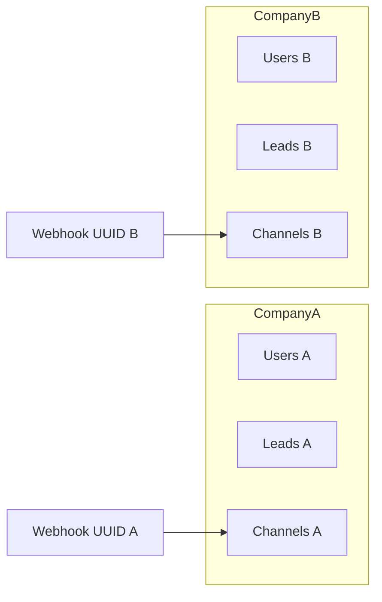

# Multi-tenancy

Each paying customer is a **Company** (tenant). Users, leads, channels, conversations, and most records belong to exactly one company.

## Concepts

| Concept | Meaning |
|---|---|
| Company | Tenant workspace (status, plan, subscription) |
| CurrentCompany | Request-scoped active `company_id` |
| CompanyScope | Global Eloquent scope filtering by CurrentCompany |
| BelongsToCompany | Trait applying scope + auto-filling `company_id` on create |
| Super Admin | Platform operator — **no** company; uses `/superadmin` |

## How context is set

Middleware `company` (`EnsureCompanyContext`):

1. Clears any previous context.
2. If the user is a Super Admin → redirect to Super Admin dashboard (tenant CRM is not their home).
3. If the user has no company / company missing / suspended / subscription expired → deny (unless impersonating).
4. Otherwise `CurrentCompany::set($company)` and touch `last_active_at`.
5. On `terminate()`, clear context.

`EnsureCompanyContext` is prepended before route-model binding so `{id}` resolution respects the company scope.

## Data isolation

- Queries on scoped models automatically add `where company_id = ?`.
- Cross-tenant access must use `Model::withoutCompanyScope()` **intentionally** (e.g. webhook UUID lookup, then set company context).

## Fail-closed behavior

`CompanyScope` (`app/Models/Scopes/CompanyScope.php`):

- If CurrentCompany is set → filter to that company.
- If **not** set:
  - **Production** (or when `TENANCY_FAIL_CLOSED_WITHOUT_CONTEXT=true`) → `whereRaw('0 = 1')` (zero rows).
  - Local/dev with config unset → scope is a no-op (helps artisan/tinker); prefer setting context explicitly.

## Webhooks and tenancy

Public channel webhook: `GET|POST /webhooks/channels/{uuid}`

1. Resolve `ChannelConnection` **without** company scope by UUID.
2. Load that connection’s company.
3. Ingest event with that `company_id`.
4. Job processing sets `CurrentCompany` from the event before running the adapter.

So each business’s WhatsApp / Facebook / webhook URL is isolated by UUID + `company_id`.

## Plan limits

`PlanLimitService` enforces `users`, `leads`, and `customers` against the company’s plan (`max_*` columns and/or `plan_limits` rows). Channel-created leads call `assertCanAddLead`.

## Impersonation

Super Admins may impersonate a company admin (logged). While impersonating, company context is the target tenant. Leave via `impersonation.leave`.

## Developer rules

1. Prefer scoped queries; don’t call `withoutCompanyScope()` unless necessary.
2. After unscoped lookup, set CurrentCompany before writes that should be tenant-owned.
3. Never trust a client-supplied `company_id` for authorization — derive from auth + scope/policy.
4. Policies should use `ChecksSameCompany` for model actions.

## Related

- [Architecture overview](overview.md)
- [RBAC](rbac.md)
- [Channels overview](../channels/overview.md)
