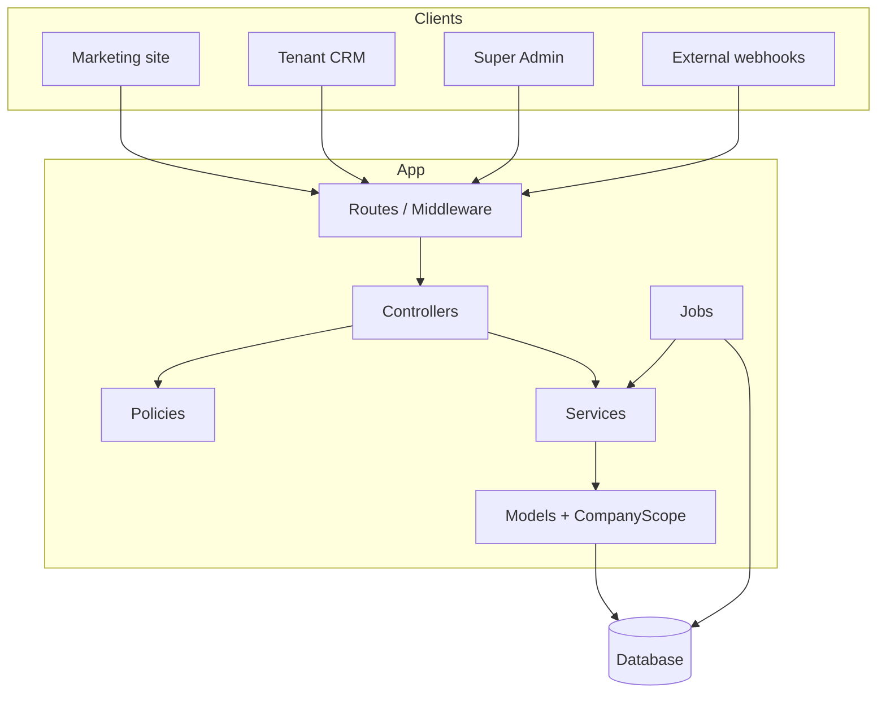
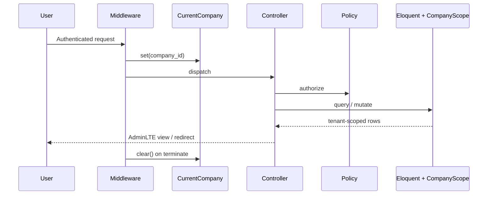

# Architecture overview

High-level design of the multi-tenant CRM.

## Stack

| Layer | Choice |
|---|---|
| Framework | Laravel 12 / PHP 8.2+ |
| Auth UI | Laravel Breeze (session auth) |
| Tenant UI | jeroennoten/laravel-AdminLTE 3 |
| Super Admin UI | Custom `sa-app` layout |
| RBAC | Custom (`config/permissions.php` + `PermissionRegistry`) — **not** Spatie |
| Queues | Database driver (default) |
| PDF | barryvdh/laravel-dompdf (Super Admin exports) |
| Frontend build | Vite |

## Logical layers

## Route groups

| Surface | Entry | Middleware highlights |
|---|---|---|
| Marketing | `routes/marketing.php` | Public |
| Tenant CRM | `routes/web.php` | `auth`, `verified.when_required`, `active`, `company` |
| Super Admin | `routes/superadmin.php` | `auth`, `active`, `superadmin` |
| Webhooks | top of `routes/web.php` | Throttle; CSRF exempt; no tenant session |

There is **no** `routes/api.php` today. Integrations use webhooks. See [API](../api/overview.md).

## Request lifecycle (tenant)

## Key directories

| Path | Responsibility |
|---|---|
| `app/Support/CurrentCompany.php` | Request-scoped tenant id |
| `app/Models/Concerns/BelongsToCompany.php` | Global scope + auto `company_id` |
| `app/Services/PermissionRegistry.php` | Sync permissions from config |
| `app/Services/Channels/*` | Omnichannel engine |
| `app/Providers/ChannelServiceProvider.php` | Register channel adapters |
| `app/Http/Middleware/EnsureCompanyContext.php` | Set/clear tenant; block suspended companies |

## Domains

### Tenant CRM
Customers, leads (kanban), tasks, inbox, channels, reports, users/roles, company profile/settings, notifications, activity logs, CSV import/export.

### Platform (Super Admin)
Companies, plans/limits, analytics, email templates, contact inquiries, platform settings/announcements, impersonation, Super Admin users.

### Channels engine
`channel_connections` → signed/verified webhooks → `channel_webhook_events` → queued processing → leads / conversations / `lead_channel_meta`.

## Design principles

1. **Tenant isolation by default** — company scope on models; fail-closed in production without context.
2. **Authorize in policies** — permission slugs `{action}.{module}`.
3. **Services over fat controllers** — channel processing, plan limits, notifications.
4. **Queue inbound channel work** — keep webhook HTTP fast (`202 Accepted`).
5. **Config-driven permissions & channel catalog** — sync with Artisan; adapters register explicitly.

## Related docs

- [Multi-tenancy](multi-tenancy.md)
- [RBAC](rbac.md)
- [Channels overview](../channels/overview.md)
- [Modules overview](../modules/overview.md)
