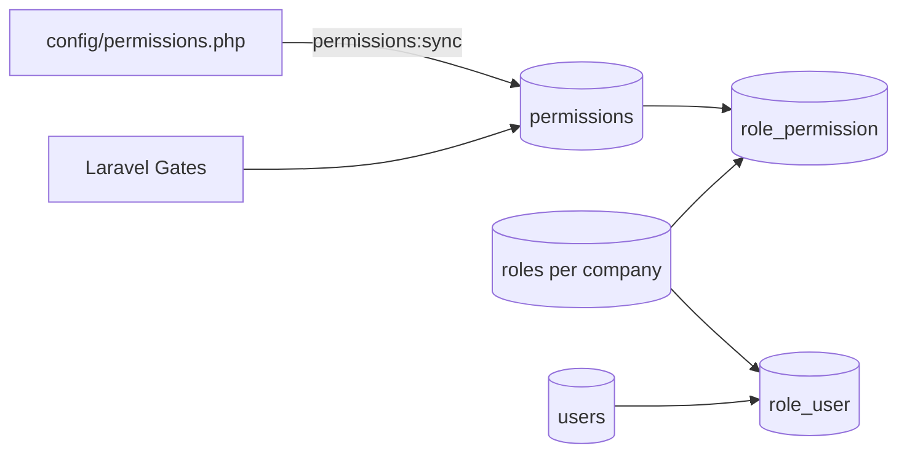

# RBAC (roles & permissions)

Custom role-based access control. Permissions are defined in config and synced to the database — **Spatie Permission is not used**.

## Model



- Permission slug format: `{action}.{module}`  
  Examples: `view.leads`, `manage.channels`, `reply.inbox`
- Roles are **per company** (after migrations that added `roles.company_id`).
- System role `admin` receives all permissions (`*`).
- Default role `sales` receives an explicit allow-list.

## Modules & actions

Source: `config/permissions.php`.

| Module | Actions |
|---|---|
| customers | view, create, import, update, delete |
| leads | view (own), view_all, create, import, update, delete, assign, convert, log |
| tasks | view (own), view_all, create, change_status, update, delete, assign |
| users | view, create, import, update, delete |
| roles | view, create, update, delete |
| activity_logs | view, view_own |
| notifications | view |
| company_settings | update |
| reports | view, export |
| demo | website_lead |
| channels | view, manage |
| inbox | view, reply, assign |

## Default sales grants

Exact list from `database/seeders/RbacSeeder.php`:

- `view/create/import/update/delete.customers`
- `view/create/import/update/delete/convert/log.leads` (no `view_all.leads`, no `assign.leads`)
- `view/change_status/update/delete.tasks` (no `create.tasks`, `view_all.tasks`, `assign.tasks`)
- `view_own.activity_logs`, `view.notifications`
- `view/export.reports`
- `view.channels` (no `manage.channels`)
- `view.inbox`, `reply.inbox` (no `assign.inbox`)

Admin (`*`) receives every synced permission. After custom Role UI edits, the database is source of truth.

## Syncing permissions

Whenever you change `config/permissions.php`:

```bash
php artisan permissions:sync
```

This will:

1. Upsert permission rows for every `{action}.{module}`.
2. Delete stale permissions (and detach them from roles).
3. Sync default roles via `RbacRoleSynchronizer`.
4. Refresh gates.

## Authorization in code

| Mechanism | Usage |
|---|---|
| `$user->hasPermission('view.inbox')` | Direct check |
| `$this->authorize('view', $model)` | Policy |
| `@can('manage', $channel)` | Blade |
| `middleware('permission:view.notifications')` | Route |

Gates are registered from DB permissions by `PermissionRegistrar`.

## AdminLTE menu

Sidebar entries use `'can' => 'view.channels'`-style gate abilities (`config/adminlte.php`). Missing menu after deploy usually means permissions were not synced.

## Adding a permission

1. Add module/action in `config/permissions.php`.
2. Run `php artisan permissions:sync`.
3. Grant on roles (UI or update `RbacSeeder` defaults).
4. Enforce via policy / middleware / `@can`.
5. Add Feature tests for allow/deny.

## Related

- [Multi-tenancy](multi-tenancy.md)
- [Modules overview](../modules/overview.md)
- [Contributing](../development/contributing.md)
