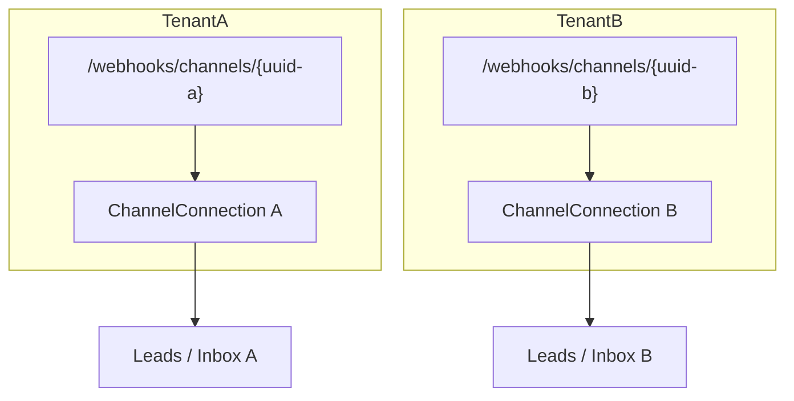
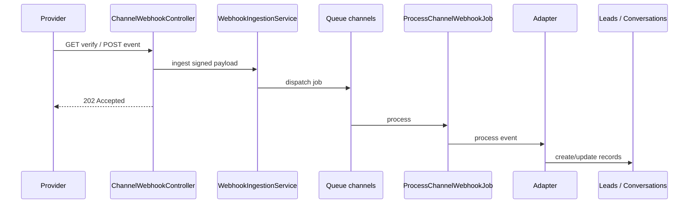

# Channels overview

Omnichannel **Channels Engine** lets each tenant connect inbound sources. Connections are per-company; webhooks are per-connection UUID.

## Status matrix

| Provider key | Label | Adapter registered | Notes |
|---|---|---|---|
| `generic_webhook` | Generic Webhook | **Yes** | Best for local E2E tests |
| `facebook_lead_ads` | Facebook Lead Ads | **Yes** | Meta leadgen + Graph fetch |
| `whatsapp_cloud` | WhatsApp Cloud API | **Yes** | Inbound + Inbox reply |
| `website_form` | Website Forms | **No** (UI listed) | Use dedicated website webhook today; builder **Planned** |
| `facebook_messenger` | Facebook Messenger | **No** | **Planned** |
| `instagram_lead_forms` | Instagram Lead Forms | **No** | **Planned** |
| `instagram_dm` | Instagram DM | **No** | **Planned** |
| `public_api` | Public API | **No** | **Planned** |

Catalog: `config/channels.php`.  
Registration: `app/Providers/ChannelServiceProvider.php`.

## Multi-tenant model



Each connection stores (as applicable): encrypted access token, webhook secret, verify token, external page/phone id, status/health.

## Pipeline



## Permissions

| Permission | Who |
|---|---|
| `view.channels` | List/show connections |
| `manage.channels` | Create, test, sync, disconnect, secrets, delete |
| `view.inbox` / `reply.inbox` / `assign.inbox` | Messaging UI |

## UI entry

**Administration → Channels**

Actions on a connection: Test, Sync, Retry (on error), Disconnect, Regenerate webhook secret, Delete.

## Environment

```env
CHANNELS_WEBHOOK_QUEUE=channels
CHANNELS_WEBHOOK_RATE_LIMIT=60
META_APP_SECRET=
META_GRAPH_VERSION=v21.0
```

Workers must listen to `channels` (see [Queues](../operations/queues.md)).

## Local Meta testing

Meta cannot call `127.0.0.1`. Use ngrok (or deploy) and set the Callback URL to:

`https://{ngrok-host}/webhooks/channels/{uuid}`

## Setup guides

- [Generic Webhook](generic-webhook.md)
- [Facebook Lead Ads](facebook-lead-ads.md)
- [WhatsApp Cloud API](whatsapp-cloud.md)
- [Website Forms](website-forms.md)
- [Facebook Messenger (Planned)](facebook-messenger.md)
- [Instagram Lead Forms (Planned)](instagram-lead-forms.md)
- [Instagram DM (Planned)](instagram-dm.md)
- [Public API (Planned)](public-api.md)
