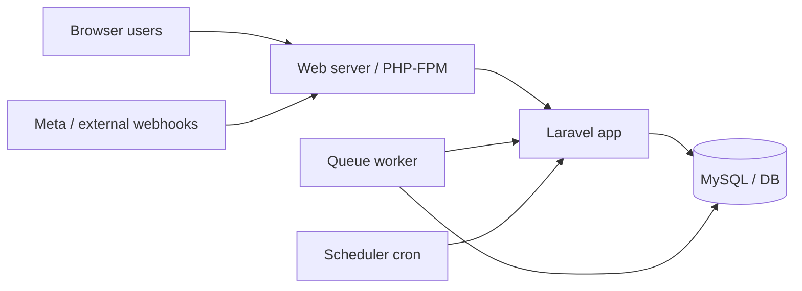

# Deployment

Production deployment guide for the multi-tenant CRM.

## Architecture in production



You need **three** long-running concerns:

1. **HTTP** — PHP-FPM / Octane / shared hosting entrypoint  
2. **Queue worker** — `channels` + `default`  
3. **Scheduler** — `php artisan schedule:run` every minute  

---

## Pre-deploy checklist

- [ ] `APP_ENV=production`, `APP_DEBUG=false`
- [ ] Strong `APP_KEY` (never commit)
- [ ] `APP_URL` is the public HTTPS URL
- [ ] `SESSION_SECURE_COOKIE=true` behind HTTPS
- [ ] Real mailer (`smtp` / SES / Postmark / Resend) — not `log`
- [ ] `QUEUE_CONNECTION=database` (or Redis if you configure it)
- [ ] `META_APP_SECRET` set if using Facebook Lead Ads / WhatsApp
- [ ] Database backups configured
- [ ] SSL certificate valid for webhook callbacks

---

## Deploy steps (typical VPS)

```bash
cd /var/www/crm
git pull origin main

composer install --no-dev --optimize-autoloader
npm ci && npm run build

php artisan migrate --force
php artisan permissions:sync
php artisan config:cache
php artisan route:cache
php artisan view:cache
php artisan event:cache   # if applicable

# restart PHP-FPM / Octane / queue workers after deploy
```

Always run migrations **before** relying on new features. For MySQL, ensure prior channel migrations completed cleanly (partial tables from failed runs must be cleaned up — see [Troubleshooting](../troubleshooting.md)).

---

## Queue worker (required)

Channel webhooks enqueue `ProcessChannelWebhookJob` on the `channels` queue.

```bash
php artisan queue:work --queue=channels,default --sleep=1 --tries=5 --timeout=90
```

**Recommended:** supervise with Supervisor / systemd so the worker restarts on failure and after deploys.

Example Supervisor program:

```ini
[program:crm-worker]
process_name=%(program_name)s_%(process_num)02d
command=php /var/www/crm/artisan queue:work --queue=channels,default --sleep=1 --tries=5 --timeout=90
autostart=true
autorestart=true
user=www-data
numprocs=1
redirect_stderr=true
stdout_logfile=/var/www/crm/storage/logs/worker.log
```

After code deploys: `php artisan queue:restart`.

Details: [Queues](../operations/queues.md).

---

## Scheduler (required)

Add a system cron entry:

```cron
* * * * * cd /var/www/crm && php artisan schedule:run >> /dev/null 2>&1
```

This drives lead/task reminders, trial notices, pruning, and platform alert jobs.

Details: [Scheduler](../operations/scheduler.md).

---

## Web server notes

- Document root: `public/`
- Allow `POST` (and `GET` for Meta verify) to:
  - `/webhooks/leads/website`
  - `/webhooks/channels/{uuid}`
- These paths are CSRF-exempt in `bootstrap/app.php`.
- Prefer HTTPS end-to-end; Meta requires a public HTTPS callback for WhatsApp / Lead Ads.

---

## Zero-downtime tips

1. Put app in maintenance: `php artisan down` (optional).
2. Deploy code + `composer install --no-dev`.
3. Migrate.
4. Rebuild caches.
5. `php artisan queue:restart`.
6. `php artisan up`.

---

## Health checks

| Check | How |
|---|---|
| App up | `GET /up` (Laravel health) |
| Scheduler alive | Super Admin platform settings / `scheduler_last_run_at` heartbeat (every 5 minutes) |
| Queues draining | `jobs` table not growing unbounded; worker logs show processed jobs |
| Webhooks | Channel detail → Recent events; Meta webhook delivery logs |

---

## Security

- Never commit `.env` or secrets shared in chat — rotate Meta tokens/App Secret if exposed.
- Restrict Super Admin accounts tightly.
- Keep `WEBSITE_LEAD_WEBHOOK_SECRET` server-side only.
- Review failed webhook events and activity logs regularly.

---

## Related

- [Installation](installation.md)
- [Configuration](configuration.md)
- [CI/CD (recommended)](../operations/cicd.md)
